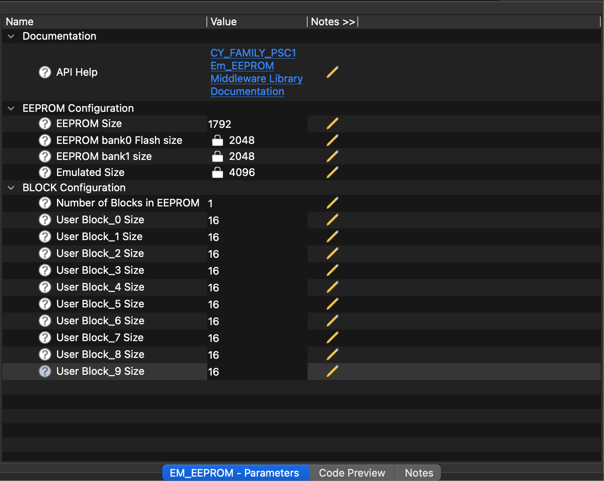

# PSOC&trade; C1 Emulated EEPROM Middleware Library

### Overview
The Emulated EEPROM middleware emulates an EEPROM device in the PSC1M2/PSC1M3 device flash memory. The EEPROM middleware operates on top of the Flash driver included in the PSC1M3 Peripheral Driver Library.

Use the Emulated EEPROM to store non-volatile data on a target device. The Emulated EEPROM asset uses the internal Flash resource to store data. The EEPROM asset is designed to allow higher erase/write capabilities compared to the underlying flash capability.

The PSOC&trade; C1 Middleware asset automatically maps the EEPROM to the required size at the end of Flash. The user can provide the required EEPROM size in the EEPROM personality or through the Makefile define: `E_EEPROM_PSC1_FLASH_EEPROM_SIZE=<size>`. The user is advised to manually modify the linker script to exclude the flash region used for EEPROM from being used for code or initialized data. This is explained in detail in the Doxygen documents linked below.

### Features
* EEPROM-like non-volatile storage
* Easy to use Read and Write API

### Quick Start
Refer to the [PSOC&trade; C1 EmEEPROM API Reference Guide](https://infineon.github.io/mtb-emeeprom-psc1/psc1_em_eeprom_api_reference_manual/html/index.html) for a complete description of the PSOC&trade; C1 Emulated EEPROM Middleware.

### PSOC&trade; C1 Personality
The PSOC&trade; C1 emulated EEPROM middleware configuration can be created using the MTB personality for EEPROM, or it can be passed to the PSOC&trade; C1 EEPROM asset through the Makefile define: `E_EEPROM_PSC1_FLASH_EEPROM_SIZE=<size>`.
The personality provides a GUI as shown below:

The user should input "EEPROM size" and the GUI will update the size of "EEPROM bank0 size", "EEPROM bank1 size" and "Emulated Size". The "Emulated Size" is the size of Flash that will be utilized for EEPROM and will be at the end of the device flash. The user has to update the application linker script to exclude this region from being used for code or initialized data. This is explained in detail in the Doxygen documents below.

The user can also select the BLOCK Configuration parameters, such as the number of blocks in EEPROM and their sizes. The personality generates `#define`s in the `cycfg_system.h` header file. The mapping of flash reserved for EEPROM is automatically handled by the EEPROM middleware. The BLOCK Configuration `#define`s have to be used by the user in their application (by including the file `cycfg.h`) to create the configuration that will be passed to the PSOC&trade; C1 Init API.

### More information
For more information, refer to the following documents:
* [Emulated EEPROM Middleware RELEASE.md](./RELEASE.md)
* [PSOC&trade; C1 Emulated EEPROM Middleware API Reference Guide](https://infineon.github.io/mtb-emeeprom-psc1/psc1_em_eeprom_api_reference_manual/html/index.html)
* [ModusToolbox Software Environment, Quick Start Guide, Documentation, and Videos](https://www.infineon.com/modustoolbox)

---
(c) 2016-2026, Infineon Technologies AG or an affiliate of Infineon Technologies AG. All rights reserved.